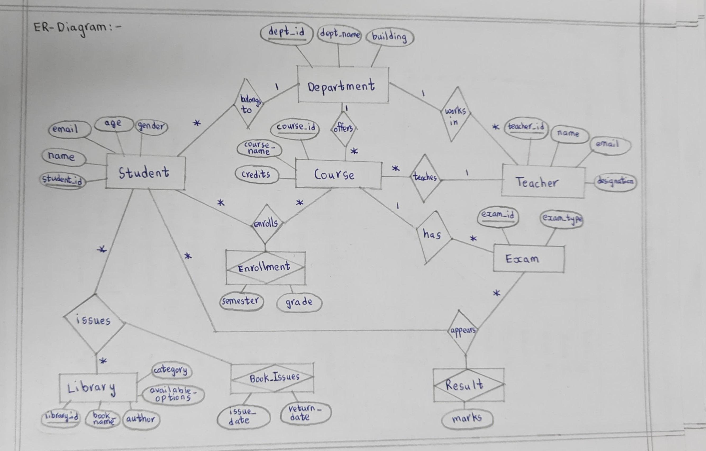

# 🎓 University Management System (DBMS Project)

## 📌 Description
This project is a relational database system designed to manage university operations including students, courses, faculty, exams, and library management.

## 🚀 Features
- Student & Department Management
- Course & Faculty Allocation
- Enrollment System (Many-to-Many)
- Exam & Result Tracking
- Library & Book Issue System

## 🛠️ Technologies Used
- SQL (MySQL)

## 🧩 Database Design
- ER Diagram included
- Normalized schema (3NF)
- Primary Keys, Foreign Keys, Composite Keys

## 📊 SQL Operations
- INSERT, UPDATE, DELETE
- WHERE clause
- JOIN operations
- GROUP BY & HAVING
- ORDER BY
- Subqueries

## 📷 ER Diagram

## 📂 Project Structure
- SQL scripts in `/SQL`
- Documentation in `/docs`

## 🔗 Future Improvements
- Add frontend interface
- Add login system
- Optimize queries
